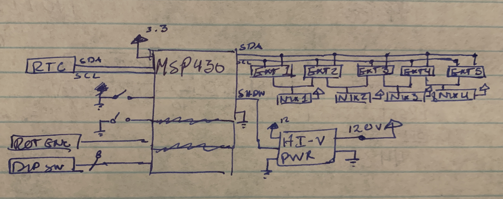
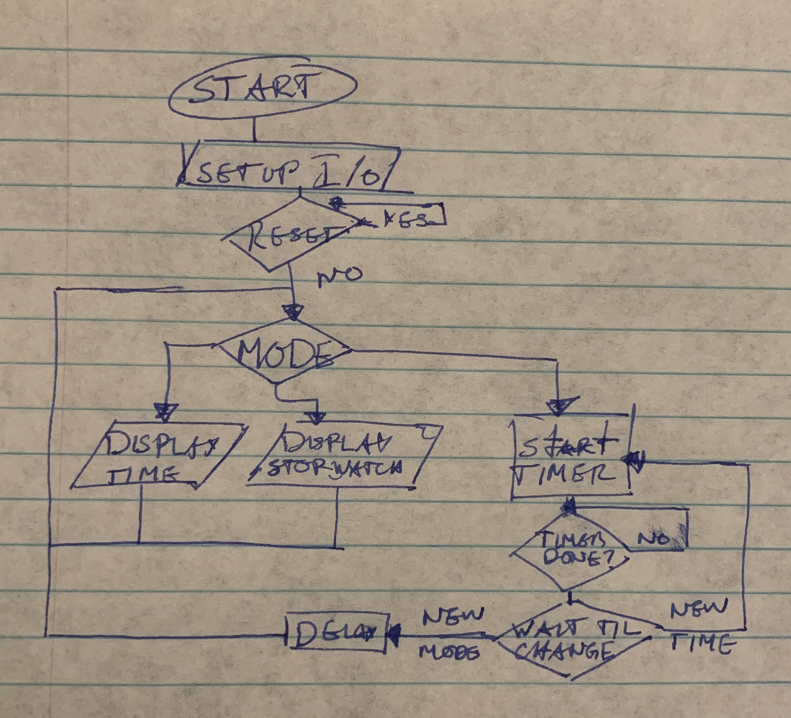

# Final project proposal

- [X] I have reviewed the project guidelines.
- [X] I will be working alone on this project.
- [X] No significant portion of this project will be (or has been) used in other course work.

## Embedded System Description

This embedded system will read the time off of a real time clock (RTC) and display it over an array of four Cold cathode neon readout tubes, also called Nixie Tubes. The system will take in user input via a dip switch to set the system into one of three modes: Tell Time, Stopwatch, and Countdown Timer. The Countdown Timer will take an additional user input via a rotary encoder to set the desired countdown

In Tell Time Mode the microcontroller will read the time register from the RTC module and decode it to Hours and Minutes. Then the microcontroller will encode the time to represent the grounded IO for the Nixie Tube segments, and then send that to the IO Extenders via I2C.

In Stopwatch Mode the Microcontroller will setup its internal timer module to track 1s intervals that will update the Nixie Array, via the IO Extenders, to display Minutes and Seconds. When switched out of this mode, it will delay on the last time for 5 seconds before switching to next mode.

In Countdown Mode, once set via the dip switch, the microcontroller will read the rotary encoder to set the timer to either 1, 2, 3, 4, or 5 minutes for a countdown timer. After a 1.5 to 2 second delay on any one of the settings, the countdown will start displaying over the Nixie Array and stop at time 00:00.

DIP switches will take in a connection of 1, 2, or 3 the microcontroller will change the mode to either countdown, stopwatch, or tell time.

if the reset switch is pressed, the system will enter a known default state. This will mean zeros written to all Nixie Tube displays, and the Shutdown pin active for the High voltage power supply. when released the program will return to the current mode as if just switched.

The slide switch, when active, will have the MSP430 activate the shutdown pin of the High Voltage Power supply.

## Hardware Setup

1.  MSP430FR2355 Microcontroller
2.  High Voltage Power Supply Module (Input 12V; Output 120-170V)
3.  Bench Power Supply (Output 12V & Output 3.3V)
4.  Slide switch
5.  Push Button
6.  DIP Switch Array
7.  4x Nixie Tubes (IN-17 or IN-12)
8.  5x I2C 8-output I/O Extenders

Inputs on the Left, Outputs on the Right. As inputs there are the RTC for time and DIP switches for modes. Along with that, there is a slide switch for operating the shutdown of the High Voltage Power Supply, and a push button to reset the system to defaults.

The nixie tubes require a constant operating voltage of 120-170V to operate necessitating a high voltage power supply to provide this condition.

Although inconvenient to program, having five 8-out extenders (40 Additional Programmable I/O) with programmable addresses is necessary because there are not enough pins on the MSP430 to operate the Nixie Tubes alone. The inconvenience is that each nixie tube requires 10 I/0 to set each number segment (0-9), and with 4 tubes that makes 40 I/0 that

Given the ammount of I/O Required, it may be more applicable to design and have a printed circuit board manufactured that has inputs for the MSP430 and output holes spaced appropriately for the Nixie tubes' through-hole components to slot into.

What hardware will you require? Provide a conceptual circuit diagram and/or block diagram to help the reviewers understand your proposal. Be sure to introduce and discuss your figures in the text.

## Software overview

While reset sets the program to defaults if active, it will loop through checking the mode and updating the Array based on the mode.

## Testing Procedure

I will need a bench supply to provide 12V and 3.3V to power the High Voltage Power Supply and the MSP340 respectively. I will demo it by showing it in each of the separate Modes, performing expected conditions. If it correctly displays the time after cycling modes, if the timer works accurately at the different times, if the stopwatch is accurate. This will be accomplished by timing side by side with an external stopwatch. As the system is designed to be small enough to implement on a breadboard, It should be portable, aside from the obvious need for an external power source.

## Prescaler

Desired Prescaler level:

- [X] 100%
- [ ] 95%
- [ ] 90%
- [ ] 85%
- [ ] 80%
- [ ] 75%

### Prescalar requirements

**Outline how you meet the requirements for your desired prescalar level**

**The inputs to the system will be:**
1.  Shutdown Switch
2.  Reset Switch
3.  Dip Switches
4.  Real Time Clock (RTC)
5.  Rotary Encoder

**The outputs of the system will be:**
1.  12-170V Power Supply
2.  Cold cathode neon readout tube (Nixie Tube) Array
3.  4x IO Expanders

**The project objective is**

Read the time from the Real Time Clock with the MSP430 to update a Nixie Tube Array to display current the time. Be able to switch between 3 modes: Tell Time, Stopwatch, and Variable Timer.

**The new hardware or software modules are:**
Short description of new hardware or software module
1.  __Dip Switches__ will set the mode of the system
2.  __Rotary Encoder__ will determine the time of the count down timer.
3.  __Nixie Tubes__ is a 10 segment display that will display the numbers of the time.
4.  __IO Expanders__ will allow the Nixie Tubes to run off of 5 MSP430 IO instead of the 40 IO

The Master will be responsible for:

Requesting the data of the I2C RTC and processing the data into a time that can
be interpreted by the IO expanders. It also is responsible for sending the
interpreted data to the IO expanders over I2C.

The Slaves will be responsible for:

The RTC: Sending the time of day to the Master
The IO Extenders: receiving the encoded data from the Master and properly grounding the Nixie Tubes

### Argument for Desired Prescaler

In this project I will be creating a clock. This is a common application for small
scale microcontrollers, However, this project attempts to exceed the simple nature
of a common clock. For starters it employs an array of IO intensive Segment displays
that have to be encoded using I2C IO Extenders which will be operated with the MSP430.
It will also read user input to operate under three distinct modes of operation,
one of which will employ a rotary encoder to further enhance user functionality.

This project uses a total of 8 IO Modules, 5 of which use Master/Slave topology.
It uses 3 substantially different hardwares than used in previous coursework.
This project has layers of complexity with different modes, user inputs, and outputs.
Lastly, I plan on using this as a clock for myself after the course is over, making it
a realistic and usable product. The reasons provided paint a picture of a project
that exceeds the expectations of a microcontroller project that fits within the
scope of this course. That being said, stripped back to the bear bones that I have
outlined, I believe that a prescaler of 100% is justified.
